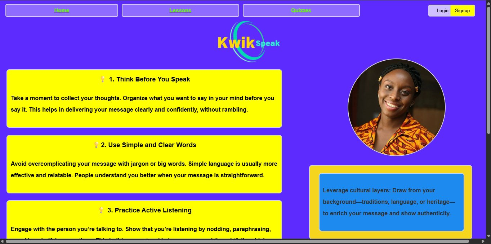

# 🗣️ KwikSpeak

KwikSpeak is a web-based learning platform designed to help individuals who struggle with expressing their thoughts clearly. It provides structured lessons, practical tips, and communication exercises aimed at improving articulation, confidence, and public speaking skills.

## 🎯 Purpose of KwikSpeak

Many people have great ideas but struggle to communicate them effectively — whether it's in interviews, presentations, or casual conversations. KwikSpeak is built to solve that problem by teaching users how to:
- Articulate their thoughts properly
- Speak with clarity and confidence
- Improve communication using real-life examples and practical lessons

---

## 🚧 Current Features

- ✅ **User Authentication System**
  - Custom user model using email instead of username
  - Login, signup, and logout flow (with CSRF protection)

- 📚 **Lessons Module**
  - Categories of lessons (video-based, content-based, practice-based)
  - Each lesson can contain text, video URL, and optional image
  - Track lesson progress per user

- 💬 **Communication Tips**
  - Admin-manageable tips displayed on the homepage
  - Fades in dynamically using JavaScript and scroll behavior

- 🧠 **Orators Section**
  - Rotating quotes and images from great speakers for inspiration

- 🎨 **Responsive UI**
  - Designed using HTML & CSS (and a bit of Tailwind-like layouting)
  - JavaScript animations for interactivity
  - Mobile & desktop-friendly layout

---

## 🛠️ Tech Stack

| Tool | Usage |
|------|-------|
| **Python** | Core backend logic |
| **Django** | Main web framework |
| **Django ORM** | Managing database models and queries |
| **Django Templates** | Rendering frontend with dynamic data |
| **HTML & CSS** | UI development |
| **JavaScript** | Scroll/fade animations and interactivity |
| **SQLite** | Lightweight database for development |
| **Media & Static Files** | Handling user-uploaded content and assets |

---

## 🧠 Personal Learning Focus

This project was created as part of my Django journey, and it's helping me apply everything I’ve learned so far:

- Mastering Django ORMs for database modeling and manipulation
- Building a custom user authentication system
- Creating modular, reusable apps inside a Django project
- Using Django views and URL routing to navigate dynamically
- Animating elements using JavaScript and enhancing user experience
- Structuring media uploads and rendering user-generated content
- Styling from scratch with HTML/CSS and basic responsiveness

---

## 📈 Future Plans

- Add interactive quizzes to test communication understanding
- Track user scores and provide feedback
- Integrate AI features (like speech-to-text feedback)
- Allow users to upload their own speaking practice and get tips
- Convert lessons into video modules with progress tracking
- Full responsiveness with design upgrade via Figma

---

## 🤝 Contributions

This is a personal project but open to collaboration. If you're interested in design, content writing, or front-end polishing — let’s build KwikSpeak together.

---

## 📬 Contact

Built with passion by **Gaji Yaqub Ayomikun**  and **Fuhad Damilola**
Let’s connect: [@codewithgaji on X](https://x.com/codewithgaji)

